# 함께사는양평 웹서비스 분석

> 분석일: 2026-07-03
> 프로젝트: C:\Users\i0wil\OneDrive\바탕 화면\project\yp_project
> DB: SQLite (prod/test) / PostgreSQL (local)

---

## 📊 ERD (Entity Relationship Diagram)

### 핵심 엔티티 관계

```mermaid
erDiagram
    user ||--o{ post : "has"
    user ||--o{ comment : "writes"
    user ||--o{ legal_post : "writes"
    user ||--o{ psycho_post : "writes"
    user ||--o{ legal_appointment : "books"
    user ||--o{ psycho_appointment : "books"
    user ||--o{ point_history : "earns"
    user ||--o{ message : "sends/receives"
    user ||--o{ friend : "friends"
    user ||--o{ tong_bot : "owns"
    user ||--o{ heritage_stamp : "stamps"
    user ||--o{ village_event_attendee : "attends"
    user ||--o{ village_wish : "wishes"
    user ||--o{ village_page : "manages"
    post ||--o{ comment : "has"
    post ||--o{ post_vote : "has"
    news_article ||--o{ news_comment : "has"
    news_article ||--o{ news_vote : "has"
    news_article ||--o{ news_recommendation : "has"
    share_report ||--o{ share_comment : "has"
    village_event ||--o{ village_event_attendee : "has"
    village_event ||--o{ village_event_chat : "has"
    friend_group ||--o{ friend : "groups"
    legal_appointment ||--o| lawyer_schedule : "uses"
    psycho_appointment ||--o| psycho_doctor_schedule : "uses"
    legal_post ||--o{ ai_feedback : "flagged"
    psycho_post ||--o{ ai_feedback : "flagged"
```

### 전체 DB 테이블 (43개)

| # | 테이블명 | 모델 클래스 | 주요 용도 |
|---|---|---|---|
| 1 | `user` | User | 회원 (role: admin/leader/user), 위치, 포인트, 소셜로그인 |
| 2 | `post` | Post | 일반 게시글 (읍‧면 게시판) |
| 3 | `comment` | Comment | 일반 댓글 |
| 4 | `share_comment` | ShareComment | 공유마당 댓글 |
| 5 | `news_article` | NewsArticle | 뉴스기사 |
| 6 | `news_comment` | NewsComment | 뉴스 댓글 |
| 7 | `news_recommendation` | NewsRecommendation | 뉴스 추천 |
| 8 | `news_vote` | NewsVote | 뉴스 투표 |
| 9 | `point_history` | PointHistory | 포인트 변동내역 |
| 10 | `message` | Message | 쪽지 |
| 11 | `share_report` | ShareReport | 공유마당 제보 |
| 12 | `store_info` | StoreInfo | 상점정보 (건설현황) |
| 13 | `construction_notice` | ConstructionNotice | 건설공지 |
| 14 | `village_alert` | VillageAlert | 마을알림 |
| 15 | `heritage_stamp` | HeritageStamp | 문화재 스탬프 |
| 16 | `tong_bot` | TongBot | 통벗 봇 |
| 17 | `tong_bot_draft` | TongBotDraft | 통벗 초안 |
| 18 | `tong_bot_schedule` | TongBotSchedule | 통벗 일정 |
| 19 | `chat_room` | ChatRoom | 채팅방 |
| 20 | `chat_message` | ChatMessage | 채팅메시지 |
| 21 | `friend_cache` | FriendCache | 벗 캐시 |
| 22 | `village_cache` | VillageCache | 마을 캐시 |
| 23 | `bot_knowledge` | BotKnowledge | 봇 지식 |
| 24 | `legal_post` | LegalPost | 법률상담 게시글 |
| 25 | `legal_appointment` | LegalAppointment | 법률 예약 |
| 26 | `lawyer_schedule` | LawyerSchedule | 변호사 스케줄 |
| 27 | `google_calendar_config` | GoogleCalendarConfig | 구글캘린더 연동 |
| 28 | `psycho_post` | PsychoPost | 심리상담 게시글 |
| 29 | `psycho_appointment` | PsychoAppointment | 심리 예약 |
| 30 | `psycho_doctor_schedule` | PsychoDoctorSchedule | 심리사 스케줄 |
| 31 | `psycho_google_calendar_config` | PsychoGoogleCalendarConfig | 심리 구글캘린더 |
| 32 | `friend_group` | FriendGroup | 벗 그룹 |
| 33 | `post_vote` | PostVote | 게시글 투표 |
| 34 | `friend` | Friend | 벗 관계 |
| 35 | `ramp_application` | RampApplication | 경사로 신청 |
| 36 | `ai_knowledge` | AiKnowledge | AI 학습데이터 |
| 37 | `village_event` | VillageEvent | 마을이벤트 |
| 38 | `village_event_attendee` | VillageEventAttendee | 이벤트 참석자 |
| 39 | `village_event_chat` | VillageEventChat | 이벤트 채팅 |
| 40 | `village_page` | VillagePage | 마을 페이지 (WYSIWYG 편집기) |
| 41 | `village_wish` | VillageWish | 마을 소원 |
| 42 | `ai_feedback` | AiFeedback | AI 판정 피드백 |
| 43 | `blocked_email` | BlockedEmail | 차단된 이메일 |
| 44 | `temp_email_verify` | TempEmailVerify | 비회원 이메일 인증토큰 |

---

## 🗂 페이지별 명세

### 1. 랜딩 / 소개

| 페이지 | URL | 템플릿 | routes.py 함수 | 주요 DB |
|---|---|---|---|---|
| 인트로 | `/`, `/intro` | `intro.html` | `intro` | `news_article` |
| SPA | `/spa`, `/spa/<path>` | `intro.html` | `spa_fallback` | — |
| 메인 | `/main` | `index.html` | `index` | `post`, `village_event` |
| 프레젠테이션 | `/presentation` | `presentation.html` | `presentation` | — |
| 약관 | `/terms` | `terms.html` | `terms` | — |
| 헌장 | `/charter` | `charter.html` | `charter` | `charter.md` (파일) |
| AI 채팅 | `/ai/chat` | `ai_chat.html` | `ai_chat` | `ai_knowledge` |

**핵심 기능:**
- `/intro`: 선택된 뉴스 6개 표시, 첫화면
- `/main`: `Post` 최신글 피드, `VillageEvent` 일정 노출
- `/ai/chat`: 양평AI 챗봇 (Groq llama-3.1-8b-instant, RAG 기반)

---

### 2. 회원 인증 / 계정

| 페이지 | URL | 템플릿 | routes.py 함수 | 주요 DB |
|---|---|---|---|---|
| 회원가입 | `/register` | `register.html` | `register` | `user` |
| 이메일인증(코드발송) | `/register/send-code` | — (JSON) | `register_send_code` | — |
| 이메일인증(코드확인) | `/register/verify-code` | — (JSON) | `register_verify_code` | — |
| 이메일인증(버튼) | `/register/verify-email-button` | — (JSON) | `register_verify_email_button` | `temp_email_verify` |
| 이메일인증(링크확인) | `/register/verify-email/<token>` | — (script) | `register_verify_email_confirm` | `temp_email_verify` |
| 로그인 | `/login` | `login.html` | `login` | `user` |
| 로그아웃 | `/logout` | — | `logout` | `user` |
| 비밀번호찾기 | `/reset-password` | `reset_password.html` | `reset_password` | `user` |
| 비밀번호재설정 | `/reset-password/<token>` | `reset_confirm.html` | `reset_password_confirm` | `user` |
| 프로필 | `/user/<id>` | `user_profile.html` | `user_profile` | `user`, `point_history`, `friend` |
| 프로필편집 | `/user/edit-profile` | `edit_profile.html` | `user_edit_profile` | `user` |
| 검색 | `/search` | `search.html` | `search` | `post`, `news_article` |

**핵심 기능:**
- 로그인: ID 또는 Email + 비밀번호, GPS 위치 저장, 30일마다 1000P 자동지급, 마을지기 추가 10000P
- 회원가입: 이메일 인증 (버튼 클릭 → 메일링크 → 확인), 가입 시 1000P 지급
- 비회원 이메일 인증: `TempEmailVerify` 토큰 기반, 30분 만료, redirect 파라미터로 원래 페이지 복귀
- 프로필: 역할 뱃지(책/관/마 중복 표시), 포인트, 위치정보, 프로필사진

---

### 3. 읍‧면 게시판 (일반 게시글)

| 페이지 | URL | 템플릿 | routes.py 함수 | 주요 DB |
|---|---|---|---|---|
| 게시글 목록 | `/town/<t>` | `town.html` | `town_router` | `post`, `comment`, `post_vote` |
| 게시글 보기 | `/post/<id>` | `view.html` | `view` | `post`, `comment`, `post_vote` |
| 게시글 작성 | `/post/create` | — | `create_post` | `post` |
| 게시글 수정 | `/post/edit/<id>` | `edit_post.html` | `edit_post` | `post` |
| 게시글 삭제 | `/post/delete/<id>` | — (script) | `delete_post` | `post` |
| 전체 제안글 | `/all-proposals` | `all_proposals.html` | `all_proposals` | `post` |

**핵심 기능:**
- 점수제: -50 ~ +50점, admin/leader/member 점수 합산
- AI 심사: `ai_score`, `ai_summary`, `ai_reason`, `ai_debate_log`, `ai_improvement_tip`
- 마감일(deadline): 만료 시 자동삭제
- 댓글: 부모댓글 참조(parent_id), 점수
- 투표: like/dislike (`post_vote`)

---

### 4. 관리자 (Admin) — role=admin/leader 전용

| 페이지 | URL | 템플릿 | routes.py 함수 | 주요 DB |
|---|---|---|---|---|
| 관리자 메인 | `/admin` | `admin.html` | `admin` | `user`, `post` |
| 관리자 글보기 | `/admin/post/<id>` | `admin_view.html` | `admin_post_view` | `post` |
| 회원관리 | `/admin/users` | `admin_users.html` | `admin_users` | `user` |
| 페이지관리자 | `/admin/page-managers` | `admin_page_managers.html` | `admin_page_managers` | `user` |
| AI 채팅관리 | `/admin/ai-chat` | `admin_ai_chat.html` | `admin_ai_chat` | — |
| AI 피드백 | `/admin/ai-feedback` | `admin_ai_feedback.html` | `admin_ai_feedback` | `ai_feedback` |
| AI 학습 | `/admin/ai-train` | `admin_ai_train.html` | `admin_ai_train` | `ai_knowledge` |
| 뉴스관리 | `/admin/news` | `admin_news.html` | `admin_news` | `news_article` |
| 뉴스작성/수정 | `/admin/news/create\|/edit/<id>` | `admin_news_create.html` | `admin_news_create`, `admin_news_edit` | `news_article` |
| 뉴스추천관리 | `/admin/news/recommendations` | `admin_news_recommendations.html` | `admin_news_recommendations` | `news_recommendation` |
| 공유마당관리 | `/admin/share-reports` | `admin_share_reports.html` | `admin_share_reports` | `share_report` |
| 경사로관리 | `/admin/ramp-applications` | `admin_ramp_applications.html` | `admin_ramp_applications` | `ramp_application` |
| 쪽지발송 | `/admin/message/send` | `admin_message.html` | `admin_message_send` | `message` |
| 상점관리 | `/admin/stores` | `admin_stores.html` | `admin_stores` | `store_info` |
| 상점등록/수정 | `/admin/stores/new\|/edit/<id>` | `admin_store_edit.html` | `admin_stores_new`, `admin_stores_edit` | `store_info` |
| 마을알림관리 | `/admin/alerts` | `admin_alerts.html` | `admin_alerts` | `village_alert` |
| 마을알림등록/수정 | `/admin/alerts/new\|/edit/<id>` | `admin_alerts_new.html`, `admin_alerts_edit.html` | `admin_alerts_new`, `admin_alerts_edit` | `village_alert` |

**핵심 기능:**
- `관리메뉴`: `session.role == 'leader'`만 접근 가능 (admin 불가)
- `has_page_access()`: leader는 non-village 자동 허용, village는 체크박스 필요
- `managed_pages`: 페이지별 관리자 지정 (legal, psycho, village, ramp 등)
- 역할 뱃지: 책(leader) / 관(admin) / 마(manager) 중복 표시
- 뉴스: AI 승인(world_ai_approved) → 관리자 승인(world_admin_approved) 2단계
- 모든 관리자에게 신규 상담글/예약변경 이메일 알림 전송

---

### 5. 법률상담 (Legal)

| 페이지 | URL | 템플릿 | routes.py 함수 | 주요 DB |
|---|---|---|---|---|
| 서비스메인 | `/service/legal` | `service_legal.html` | `service_legal` | `village_page` |
| 서비스편집 | `/service/legal/edit` | `service_legal_edit.html` | `service_legal_edit` | `village_page` |
| 게시판목록 | `/legal/list` | `legal_board.html` | `legal_list` | `legal_post` |
| 글쓰기 | `/legal/write` | `legal_write.html` | `legal_write` | `legal_post` |
| 글보기 | `/legal/post/<id>` | `legal_post.html` | `legal_post` | `legal_post` |
| 글수정 | `/legal/post/<id>/edit` | `legal_post_edit.html` | `legal_post_edit` | `legal_post` |
| 글삭제 | `/legal/post/<id>/delete` | — (script) | `legal_post_delete` | `legal_post` |
| 예약하기 | `/legal/schedule` | `legal_schedule.html` | `legal_schedule` | `legal_appointment`, `lawyer_schedule` |
| 예약수정 | `/legal/appointment/<id>/edit` | `legal_appointment_edit.html` | `legal_appointment_edit` | `legal_appointment` |
| 관리자(게시글) | `/legal/admin` | `legal_admin.html` | `legal_admin` | `legal_post` |
| 관리자(예약) | `/legal/admin/appointments` | `legal_admin_appointments.html` | `legal_admin_appointments` | `legal_appointment`, `lawyer_schedule` |
| AI 판정 | `/legal/admin/ai-decision/<id>` | — (JSON) | `legal_admin_ai_decision` | `legal_post`, `ai_feedback`, `blocked_email` |
| 답변등록 | `/legal/admin/answer/<id>` | — | `legal_admin_answer` | `legal_post` |
| 예약승인/거절 | `/legal/admin/appointment/<id>/approve\|/reject` | — | `legal_appointment_approve/reject` | `legal_appointment` |
| 스케줄설정 | `/legal/admin/schedule` | — (script) | `legal_admin_schedule` | `lawyer_schedule` |
| AI 보기설정 | `/legal/admin/viewed/<id>` | — | `legal_admin_mark_viewed` | `legal_post` |
| 노동이슈목록 | `/legal/issues` | `labor_board.html` | `legal_issues` | `legal_post` |
| 노동이슈쓰기 | `/legal/issues/write` | `labor_write.html` | `legal_issues_write` | `legal_post` |
| 노동이슈상세 | `/legal/issues/<id>` | `labor_detail.html` | `legal_issue_detail` | `legal_post` |
| 노동이슈관리 | `/legal/issues/admin` | `labor_admin.html` | `legal_issues_admin` | `legal_post` |

**핵심 기능:**
- `viewed_at`: 관리자가 글을 보면 NULL → 시간 기록, 이후 수정/삭제 불가
- `flagged_decision_at`: AI 보류글에 관리자 판정 시간 기록
- AI 보류: `ai_score < 0` → status=flagged → 빨간색 표시 → Yes(작성자 24h 수정기회) / No(해제)
- 3회 보류 → `BlockedEmail` 등록 → 해당 이메일 영구차단
- 24h 자동삭제: 보류 후 24시간 경과 + 미판정 → 자동삭제
- 비회원: 이메일 인증(버튼+메일링크) → 본인글만 목록 표시 → `🔒 비회원글` 제목 숨김
- 회원: 로그인 시 자동입력, 비번 불필요
- 예약: D+2 ~ D+61일 (range(2,62)), 통벗 일정 충돌 체크
- 모든 관리자(admin+leader)에게 신규 상담글/예약 이메일 알림
- 노동이슈: 별도 `labor_approved` 필드로 관리

---

### 6. 심리상담 (Psycho)

| 페이지 | URL | 템플릿 | routes.py 함수 | 주요 DB |
|---|---|---|---|---|
| 서비스메인 | `/service/psycho` | `service_psycho.html` | `service_psycho` | `village_page` |
| 서비스편집 | `/service/psycho/edit` | `service_psycho_edit.html` | `service_psycho_edit` | `village_page` |
| 게시판목록 | `/psycho/list` | `psycho_board.html` | `psycho_list` | `psycho_post` |
| 글쓰기 | `/psycho/write` | `psycho_write.html` | `psycho_write` | `psycho_post` |
| 글보기 | `/psycho/post/<id>` | `psycho_post.html` | `psycho_post` | `psycho_post` |
| 글수정 | `/psycho/post/<id>/edit` | `psycho_post_edit.html` | `psycho_post_edit` | `psycho_post` |
| 예약하기 | `/psycho/schedule` | `psycho_schedule.html` | `psycho_schedule` | `psycho_appointment`, `psycho_doctor_schedule` |
| 관리자(게시글) | `/psycho/admin` | `psycho_admin.html` | `psycho_admin` | `psycho_post` |
| 관리자(예약) | `/psycho/admin/appointments` | `psycho_admin_appointments.html` | `psycho_admin_appointments` | `psycho_appointment`, `psycho_doctor_schedule` |
| 답변등록 | `/psycho/admin/answer/<id>` | — | `psycho_admin_answer` | `psycho_post` |
| 예약승인/거절 | `/psycho/admin/appointment/<id>/approve\|/reject` | — | `psycho_appointment_approve/reject` | `psycho_appointment` |
| 스케줄설정 | `/psycho/admin/schedule` | — | `psycho_admin_schedule` | `psycho_doctor_schedule` |
| AI 보기설정 | `/psycho/admin/viewed/<id>` | — | `psycho_admin_mark_viewed` | `psycho_post` |
| AI 판정 | `/psycho/admin/ai-decision/<id>` | — (JSON) | `psycho_admin_ai_decision` | `psycho_post`, `ai_feedback`, `blocked_email` |

**핵심 기능:**
- Legal과 동일한 구조 (게시판, 예약, AI 보류, 답변)
- `PsychoDoctorSchedule`: 월~금 10-16시 기본 시드 데이터
- 구글캘린더 연동: `PsychoGoogleCalendarConfig`

---

### 7. 마을 (Village)

| 페이지 | URL | 템플릿 | routes.py 함수 | 주요 DB |
|---|---|---|---|---|
| 마을관리 | `/village` | `village_admin.html` | `village_admin` | `village_page`, `village_cache` |
| 마을페이지편집 | `/village/page` | `village_page_edit.html` | `village_page_edit` | `village_page` |
| 마을페이지보기 | `/village/view/<tmyeon>/<tri>` | `village_page_view.html` | `village_page_view` | `village_page` |
| QR | `/village/qr` | `village_qr.html` | `village_qr` | — |
| 이벤트목록 | `/village/events` | `village_event_list.html` | `village_events` | `village_event` |
| 이벤트생성 | `/village/event/create` | `village_event_create.html` | `village_event_create` | `village_event` |
| 이벤트보기 | `/village/event/<id>` | `village_event_view.html` | `village_event_view` | `village_event`, `village_event_attendee`, `village_event_chat` |
| 이벤트QR | `/village/event/<id>/qr` | `village_event_qr.html` | `village_event_qr` | `village_event` |
| 초대 | `/village/invite/<path>` | `village_jin_consent.html` | `village_invite` | `village_cache` |
| 소원목록 | `/village/my-wishes` | `village_my_wishes.html` | `village_my_wishes` | `village_wish` |
| 마을가입 | `/village/join` | `village_join.html` | `village_join` | `user`, `village_cache` |

**핵심 기능:**
- 마을 페이지: myeon/ri 단위 WYSIWYG 편집기 (VillagePage)
- 이벤트: 생성 → QR코드 → 참석 → 실시간 채팅
- 소원: 주민 제안 → 관리자 답변
- 초대: jin_consent (동의) 기반
- 마을캐시: `VillageCache`로 town/village별 통계 캐싱

---

### 8. 공유마당 (Share)

| 페이지 | URL | 템플릿 | routes.py 함수 | 주요 DB |
|---|---|---|---|---|
| 공유마당메인 | `/share` | `share.html` | `share` | `share_report` |
| 공유마당지도 | `/share/map` | `share_map.html` | `share_map` | `share_report` |
| 공유마당제보 | `/share-report` | `share_report.html` | `share_report` | `share_report` |
| 공유마당상세 | `/share/detail/<id>` | `share_detail.html` | `share_detail` | `share_report`, `share_comment` |
| 리더제보관리 | `/leader/share-reports` | `leader_share_reports.html` | `leader_share_reports` | `share_report` |

**핵심 기능:**
- 위치 기반 제보 (GPS + 주소)
- 이미지/그림/동영상 첨부
- AI 자동 분석: `ai_category`, `ai_summary`, `ai_confidence`, `ai_danger_alert`
- 점수제: admin/leader/member 점수 합산 → `total_score`
- 관리자 승인 workflow (status: pending → approved/rejected)
- 스마트플레이스 연동: `smartplace_url`

---

### 9. 건설현황 / 상점

| 페이지 | URL | 템플릿 | routes.py 함수 | 주요 DB |
|---|---|---|---|---|
| 건설현황맵 | `/construction` | `construction.html` | `construction` | `construction_notice`, `store_info` |
| 상점상세 | `/construction/store/<name>` | `store_detail.html` | `construction_store_detail` | `store_info` |

**핵심 기능:**
- 건설공사 + 상점 통합 지도뷰
- `ConstructionNotice`: 공사기간(start_date/end_date), is_active
- `StoreInfo`: 우리동네링크, 스마트플레이스 연동

---

### 10. 경사로 (Ramp)

| 페이지 | URL | 템플릿 | routes.py 함수 | 주요 DB |
|---|---|---|---|---|
| 경사로서비스 | `/service/ramp` | `service_ramp.html` | `service_ramp` | `ramp_application` |
| (신청) | — | — | `ramp_apply` | `ramp_application` |

**핵심 기능:**
- 경사로 설치 신청 (사진, 단차높이, 소유권, 철거동의, 파손동의)
- 관리자 승인 workflow

---

### 11. 벗 (Friends)

| 페이지 | URL | 템플릿 | routes.py 함수 | 주요 DB |
|---|---|---|---|---|
| 벗목록 | `/friends` | `friends.html` | `friends` | `friend`, `friend_group`, `user` |
| 벗지도 | `/friends/map` | `friends_map.html` | `friends_map` | `user` |
| (벗맺기/끊기) | — | — | `friend_request/accept/reject/remove` | `friend`, `message` |

**핵심 기능:**
- 그룹 관리 (`FriendGroup`)
- 요청/수락/거절/끊기 → Message 연동 자동발송
- `FriendCache`로 빠른 조회

---

### 12. 포인트 / 쪽지

| 페이지 | URL | 템플릿 | routes.py 함수 | 주요 DB |
|---|---|---|---|---|
| 포인트내역 | `/mypage/points` | `mypage_points.html` | `mypage_points` | `point_history` |
| 포인트충전 | `/mypage/points/charge` | `points_charge.html` | `points_charge` | `point_history` |
| 쪽지함 | `/message/inbox` | `message_inbox.html` | `message_inbox` | `message` |
| 쪽지보내기 | `/message/send/<id>` | `send_message.html` | `send_message` | `message` |

**핵심 기능:**
- 가입 시 1000P, 30일마다 1000P, 마을지기 추가 10000P
- 쪽지: 첨부파일(attachment) 지원, role 기반 전체발송(admin 전용)

---

### 13. 통벗 (TongBot) — 별도 Blueprint

| 페이지 | URL | 템플릿 | 소스파일 | 주요 DB |
|---|---|---|---|---|
| 통벗채팅 | (TongBot routes) | `chat.html` | `tongbot_routes.py` | `tong_bot`, `chat_room`, `chat_message` |
| 통벗일정 | (TongBot routes) | `schedule2.html` | `tongbot_routes.py` | `tong_bot_schedule` |
| 통벗초안 | (TongBot routes) | — | `tongbot_routes.py` | `tong_bot_draft` |

**핵심 기능:**
- AI 통벗 챗봇 (개인별 페르소나), 채팅방, 일정관리
- 초안 리뷰: `bot_review`, `bot_suggestion`

---

## 🔐 주요 비즈니스 로직 규칙

| 규칙 | 설명 | 관련 파일 |
|---|---|---|
| **비회원 인증** | 이메일 입력 → 버튼 → 메일링크(30분) → 인증 → 세션 저장 | `routes.py:register_verify_email_button`, `models.py:TempEmailVerify` |
| **비회원 글필터** | 인증된 이메일로 작성한 글만 목록에 표시 | `routes.py:legal_list`, `routes.py:psycho_list` |
| **비회원 제목숨김** | 비로그인 사용자에게 `🔒 비회원글`로 표시 | `legal_board.html`, `psycho_board.html` |
| **수정/삭제 조건** | `viewed_at IS NULL`일 때만 가능 (관리자가 보기 전) | `routes.py:legal_post`, `routes.py:psycho_post` |
| **AI 보류** | ai_score < 0 → status=flagged → 빨간색 표시 → Yes/No 판정 | `routes.py:legal_admin_ai_decision`, `services/ai_service.py` |
| **AI 차단** | 3회 보류 → BlockedEmail 등록 → 해당 이메일 영구차단 | `routes.py:legal_admin_ai_decision` |
| **24h 자동삭제** | 보류 후 24시간 경과 + 미판정 → 자동삭제 | `run.py` (startup) |
| **관리메뉴** | `session.role == 'leader'`만 접근 (admin 불가) | `layout.html` |
| **역할뱃지** | 책(leader) / 관(admin) / 마(manager from managed_pages) | `admin_users.html`, `user_profile.html`, `admin_page_managers.html` |
| **관리자 알림** | 모든 admin+leader에게 신규 상담글/예약 이메일 전송 | `routes.py:legal_write`, `routes.py:psycho_write`, `routes.py:legal_appointment_book` 등 |
| **has_page_access()** | leader: non-village 자동허용, village는 managed_pages에 vi_ 또는 village 필요 | `routes.py` |
| **관리버튼 위치** | 페이지 오른쪽 상단 `d-flex justify-content-end` 배치 | `service_legal.html`, `service_psycho.html` |
| **예약 날짜** | D+2 ~ D+61일 (range(2, 62)) | `routes.py:legal_schedule`, `routes.py:psycho_schedule` |
| **PsychoDoctorSchedule** | 월~금 10-16시, 2시간 슬롯 기본 시드 | `run.py`, `routes.py` |

---

## 📁 주요 소스파일 구조

| 파일명 | 역할 | 비고 |
|---|---|---|
| `run.py` | 앱 생성/실행, DB 마이그레이션, 시드데이터 | ~867줄 |
| `routes.py` | 모든 웹 라우트 | ~5,450줄 |
| `route_modules/auth_bp.py` | 인증 블루프린트 | 현재 미사용 (routes.py에 중복) |
| `tongbot_routes.py` | 통벗 전용 라우트 | 별도 Blueprint 등록 |
| `models.py` | 모든 DB 모델 정의 | 43개 클래스 |
| `config.py` | 설정 (DB_MODE 등) | |
| `services/email_service.py` | 이메일 발송 (Cafe24 SMTP) | SMTP_SSL + STARTTLS |
| `services/ai_service.py` | AI 심사/모더레이션 | Groq llama-3.1-8b-instant |
| `services/geocode.py` | GPS → 읍면동 변환 | |
| `services/oauth.py` | 소셜로그인 | Google/Kakao/Naver |
| `services/cache_refresh.py` | 캐시 갱신 | |
| `services/rag.py` | RAG 인덱스 재구축 | |
| `templates/*.html` | 96개 템플릿 | layout.html base |

---

## 🌐 환경 구성

| 환경 | 서버 | IP | DB | Git 브랜치 | 도메인 |
|---|---|---|---|---|---|
| **Prod** | AWS Lightsail 8GB | 3.38.34.11 | `~/yp_project/instance/yangpyeong_v10.db` (SQLite) | `master` | `https://unocum.kr` |
| **Test** | AWS Lightsail 8GB | 3.38.34.11 | `~/yp_project_dev/instance/yangpyeong_v10.db` (SQLite) | `dev` | `https://test.unocum.kr` |
| **Local** | Windows | localhost:5000 | PostgreSQL (Docker) or SQLite | `dev` | `http://localhost:5000` |

**실행 방식:** Supervisor (gunicorn -w 1)
- `yp_app`: prod (port 5001)
- `yp_dev`: test (port 5000)

**외부 서비스:**
- SMTP: `smtp.cafe24.com:587` / `yp@unocum.kr`
- AI: Groq API (`llama-3.1-8b-instant`)
- OAuth: Google / Kakao / Naver 소셜로그인
- 지도: GPS 기반 위치 서비스

---

## 🔧 변경 작업: 홍보 → 마을 텍스트 변경

`홍보`라는 텍스트를 `마을`로 변경해야 하는 파일과 위치입니다.

### 변경 대상 파일 (4개)

| # | 파일 | 줄 | 현재 텍스트 | 바꿀 텍스트 |
|---|---|---|---|---|
| 1 | `templates/layout.html` | 54 | `📖 홍보` | `📖 홍보` → `📖 마을` |
| 2 | `templates/village_admin.html` | 18 | `📝 홍보` | `📝 홍보` → `📝 마을` |
| 3 | `templates/village_page_edit.html` | 4 | `}} 홍보` | `}} 홍보` → `}} 마을` |
| 4 | `templates/village_qr.html` | 16 | `' 홍보'` | `' 홍보'` → `' 마을'` |

### 변경 방법

각 파일에서 `홍보`를 찾아(`Ctrl+Shift+F`) `마을`로 바꾸면 됩니다. 총 4군데입니다.
